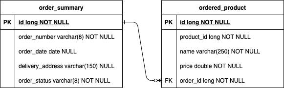
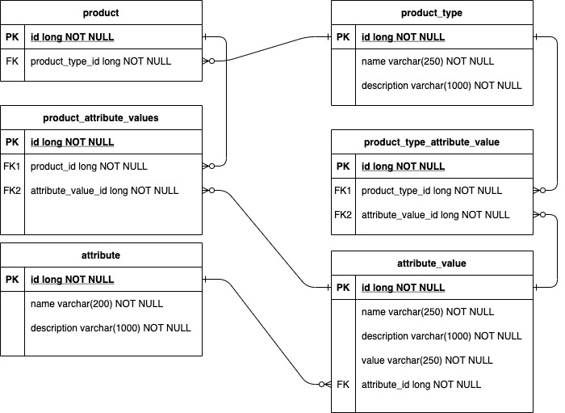
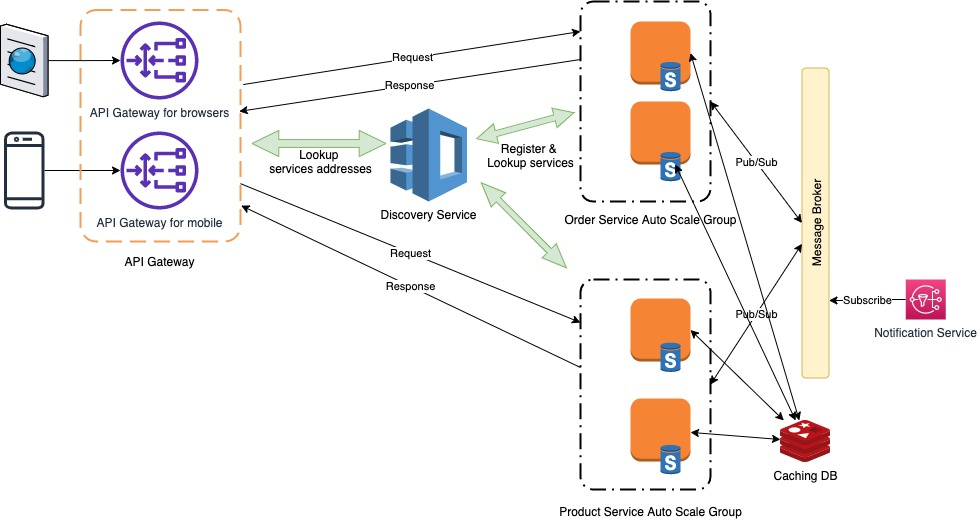

# hai-mvp-demo

## Principles & Patterns
### S.O.L.I.D
* For single responsibility principle, OrderController, OrderManagementController are in charged of one responsibility for handling command requests.
Whereas, OrderQueryController, OrderQueryService, ProductQueryController and ProductQueryService are in charged of query requests.
* There are 2 service instances which are open for being wrapped or extended by external services but closed for modification.
* For Liskov Substitution Principle, there isn't any demonstration for this principle in the implementation.
* For Interface Segregation Principle, order operations are divided into 2 services OrderManagementService and OrderQueryService.
A client for query orders should implement only OrderQueryService and likewise with OrderManagementService for creating, updating and deleting orders.
* For Dependency Inversion Principle, controller classes depend on service interfaces and don't depend on service implementation.

### Patterns
* ProductBuilder uses builder pattern.

## Folder Structure

Projects api-gateway, discovery-service, order-service, product-service uses default gradle structure.

module-folder:
* gradle
* src
  * main
    * java
    * resources
  * test
      * java
    * resources
* build.gradle
* gradlew
* gradlew.bat
* HELP.md
* settings.gradle

## Dependencies & Frameworks
### For order-service and product-service
These two projects use the below libraries & frameworks:
* Spring boot framework version 2.5.3
* Spring HATEOAS
* Spring data JPA
* Spring boot web, tomcat, devtools, test, configuration processor
* Netflix Eureka Client
* H2 database

### For api-gateway
The project uses the following libraries & frameworks:
* Spring boot framework version 2.5.3
* Spring cloud gateway
* Netflix Eureka Client
* Spring boot web, tomcat, devtools, test, configuration processor

### For discovery-service
The project uses the following libraries & frameworks:
* Spring boot framework version 2.5.3
* Netflix Eureka Server
* Spring boot web, tomcat, devtools, test, configuration processor

## Database diagram
### Order Service

### Product Service

## Solution diagram

## Build & Run
Please follow the below steps to build:
> cd api-gateway
> 
> ./gradlew build
> 
> cd ../discovery-service
> 
> ./gradlew build
> 
> cd ../product-service
> 
> ./gradlew build
> 
> cd ../order-service
> 
> ./gradlew build

Please follow the below steps to run all modules:
> java -jar ./discovery-service/build/libs/discovery-service-0.0.1-SNAPSHOT.war
> 
> java -jar -Dapp_port=8080 ./api-gateway/build/libs/api-gateway-0.0.1-SNAPSHOT.war
>
> java -jar -Dapp_port=9080 ./product-service/build/libs/product-service-0.0.1-SNAPSHOT.war
> 
> java -jar -Dapp_port=9090 ./order-service/build/libs/order-service-0.0.1-SNAPSHOT.war

## Example CURL commands

### To list all products
> curl 'http://localhost:8080/products/'

### To list products by filter
We have to build json array of filters. Each filter contain the following attributes:
* attributeId: this is long number which matches Attribute.id
* operator: this contains only "IN", "EQUAL", "RANGE"
* values: this is an array of string values. If operator is "RANGE", then values array should contain only 2 numbers, ex: ["1", "100"] 

> [{"attributeId":1,"operator": "IN","values": ["IEMs"]}]

Then the above filter must be encoded into URL encoding as below
> %5B%7B%22attributeId%22%3A1%2C%22operator%22%3A%20%22IN%22%2C%22values%22%3A%20%5B%22IEMs%22%5D%7D%5D

Finally, we have the final curl command
> curl 'http://localhost:8080/products?filter=%5B%7B%22attributeId%22%3A1%2C%22operator%22%3A%20%22IN%22%2C%22values%22%3A%20%5B%22IEMs%22%5D%7D%5D'

### To play an order

First, we have to place a new order
> curl -X POST http://localhost:8080/orders/ \
    -H "Content-Type: application/json" \
    -d '{"id": 60,"name": "Campfire Solaris","amount": 1,"price": 1200}'

The command will return a link to add more item into existing order, ex: http://localhost:8080/orders/AZjaxxWx.

> curl -X POST http://localhost:8080/orders/AZjaxxWx \
    -H "Content-Type: application/json" \
    -d '{"id": 1,"name": "Focal Clear","amount": 1,"price": 1300}'  